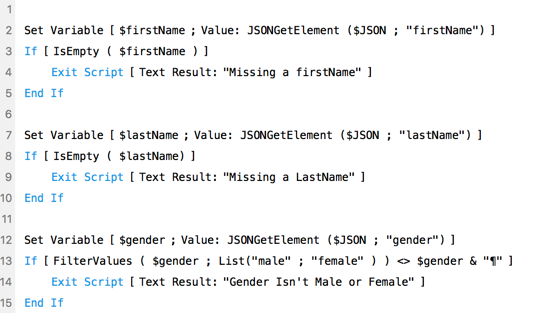
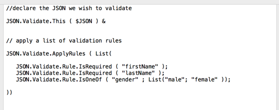

# JSON.Validate Custom Functions

> For FileMaker Pro 16 and above

## Introduction

Validating JSON with Script Steps can be tedious.  For example, If I want to validate three properties of my JSON in a script I may have to do this.



### Imperitive Vs Declaritive
This tedious becuase we have to tell FileMaker how to validate the object imperitively. If we could simply "Declare" our rules it would be easier.

Here is that same logic usign Custom Functions to Declaratively validate our JSON



If any of these rules fail we'll get an Error as the result of this function.  If all rules failed  passed we'd get

```JSON
{
  "errorCode" : 0
}
```
If they all failed it would look like this

```json
{
	"errorCode" : -2,
	"errors " : 
	[
		{
			"descriptor" : "Required value is missing",
			"errorCode" : -2,
			"path" : "firstName",
			"type" : "JSON.Validate"
		},
		{
			"descriptor" : "Required value is missing",
			"errorCode" : -2,
			"path" : "lastName",
			"type" : "JSON.Validate"
		},
		{
			"descriptor" : "Should be one of male,female",
			"errorCode" : -2,
			"path" : "gender",
			"type" : "JSON.Validate"
		}
	],
	"type" : "JSON.Validate"
}
```

This "error" JSON follows the format we have described [in the Error Custom Function Repo](https://github.com/karbonfm/fm-error-functions).  There is a function in that set, called `Error.IsError()`, that can detect if the above JSON is an "error"

## Documentation and Usage

Check out the Tests in the JSON.Validate.fmp12 file. They should show you how to use it.

Also each function is documented [here](docs/index.md) and in the CF itself.